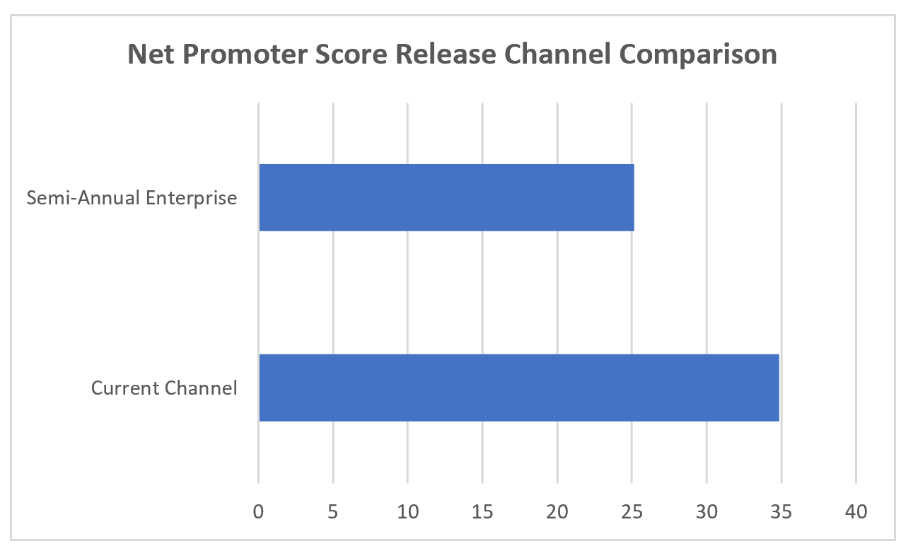
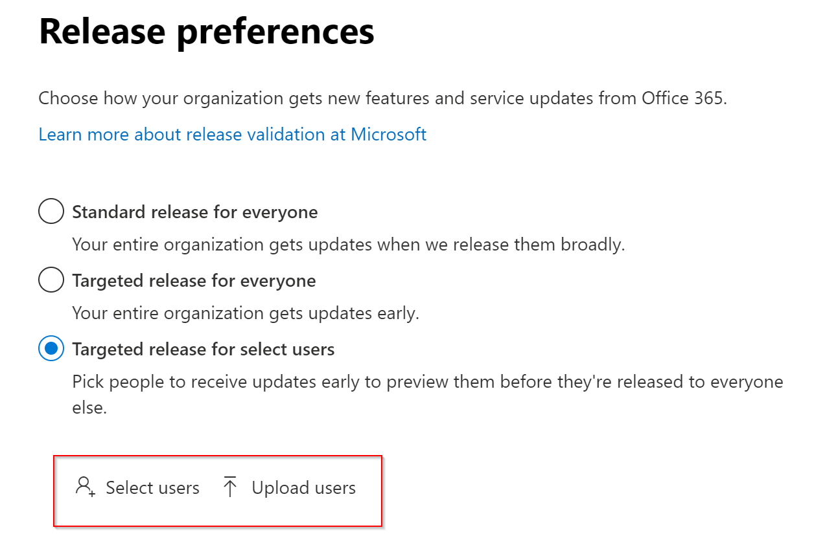
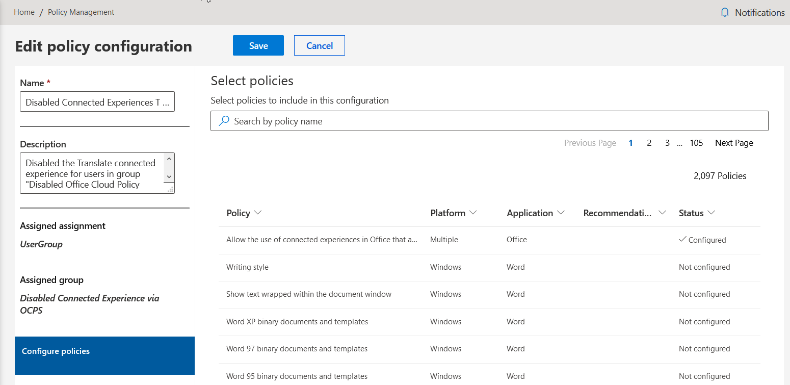
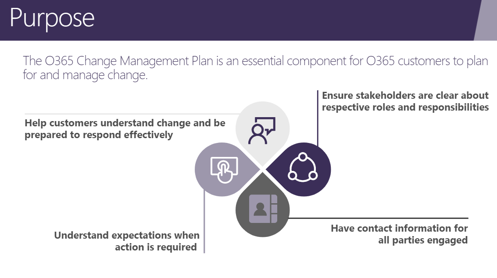
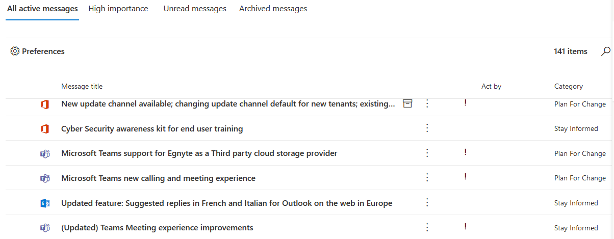
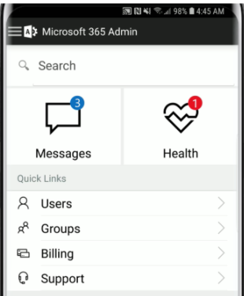
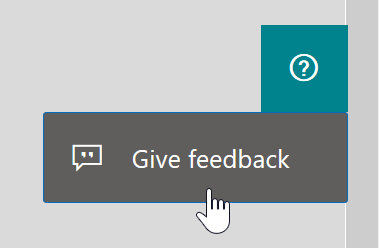
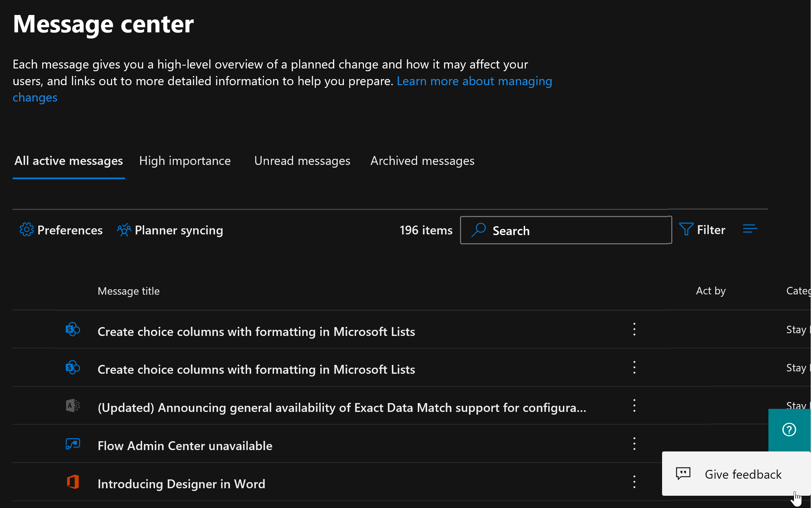
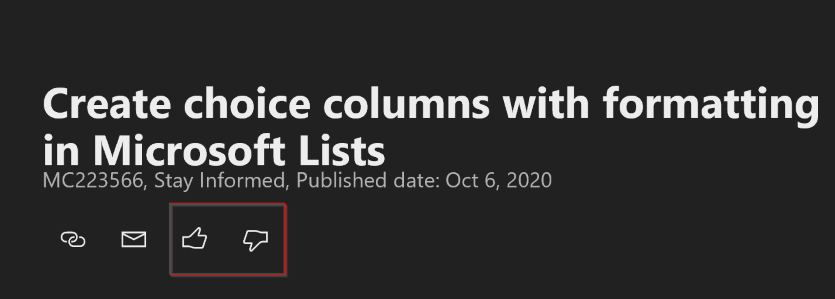

# Microsoft 365 change guide

> [!NOTE]
> This article was written by Microsoft experts in the field who work with enterprise customers to deploy Office.

> [!IMPORTANT]
> The information in this article applies to the Microsoft 365 multitenant environment.

## Continuous change in the cloud

The Microsoft 365 cloud environment is a hyperscale suite of service offerings that's constantly changing. In the technology industry, being consistently cutting-edge benefits productivity, security, and user happiness. Change in the Microsoft cloud has purpose: to deliver customer value, secure the environment, and delight users. The pace of change in Microsoft 365 is rapid and continuous - both adjectives describe the customer value pipeline that this model helps. Microsoft helps users increase efficiency in their organizations by offering innovative features and secure services.

Microsoft uses an agile development model that promotes rapid development. This model shortens the time from when a change is initiated to when it's in production. To help improve usability, we aim to shorten the time between feature implementation and value realization for our customers. Agile development is important in the modern cloud environment. Using it, we can nimbly adjust engineering priorities that's based on customer feedback, market dynamics, regulatory requirements, and emerging risks. Swift integration of changes into your environment means that we receive feedback data faster, and then we can iteratively improve our services.

Many changes relate to new features that are designed to enhance the user experience. These changes are a category of change that's within a broader set. The broader set of categories of change includes service maintenance, security updates, and updates to meet the needs of the ever-changing regulatory and compliance landscape.

Microsoft constantly improves Microsoft 365 services to help every person and every organization on the planet to achieve more. Our commitment to enhancing the user experience means that we offer a continuous stream of updates to the service. And to ease your deployment planning, we release client updates in alignment with release cycles. We design new features to improve productivity and delight users. Equally important is for features to operate in a secure and compliant environment. As part of the [shared responsibility model](https://docs.microsoft.com/azure/security/fundamentals/shared-responsibility), Microsoft takes extensive measures to secure our environment. Our certifications hosted on the Microsoft [Service Trust Portal](https://aka.ms/stp) evidence our compliance with 100+ frameworks. The other half of the responsibility model – your environment – must also be secure and compliant, so we carefully consider potential customer impact when we structure our changes and the surrounding processes.

Historically, the deployment of changes within customer organizations has been tightly controlled by IT departments. Controlling deployments within your tenant holds a place in the modern cloud landscape, but faster feature deployment is key to realizing value for your users. As the Microsoft cloud further adopts a continuous update model, organizations’ ability to make risk-based decisions on which changes require granular evaluation and which can be implemented immediately becomes paramount.

When Microsoft adds capabilities, and users leverage these capabilities, the user experience improves as supported by data. At the time of writing, a comparison of net promoter score (NPS)[[1]](#footnote-1) between customers using the continuous update channel (Current Channel) and the Semi-Annual Enterprise Channel shows a 10-point advantage[[2]](#footnote-2) to the continuous update channel for Microsoft 365 Apps (previously called Office 365 ProPlus). Figure 1 shows a comparison.

*Figure 1*

Our goal is to provide your organization with changes that can be controlled (where possible), if deemed impactful to the organization, while still allowing the majority of changes to flow to users to enhance value, productivity, collaboration, and security.

## Controlling change: challenges and strategy

Despite the overwhelming benefits of rapid feature release and adoption, it's important to use a robust change management strategy. We recognize that managing change, especially continuous cloud change, can be challenging for organizations. IT departments and other lines of defense often believe that each change must be reviewed in depth before they deploy new software in their environments. This might be an advantageous strategy for a subset of high impact changes, but reviewing 100 percent of changes is a burdensome strategy that delays deployment of the endlessly evolving features that enable your users.

Not all features or changes have the potential to impact your security or compliance stature, so it might not be necessary to deeply analyze every single change. For changes that are impactful, we provide configuration options for controlling related features. To help users adopt new features, by default, these changes are generally on - action is required on your part to disable or limit these features.

The ability to control impactful changes is a differentiator offered by Microsoft. The technology industry is predominantly focused on innovation, which is generally assumed to have positive impact on users. It is not common to find granularity of control over these innovations offered by technology leaders or other cloud providers. By respecting your right to control most impactful changes, we're demonstrating our commitment to partnership and ultimately your success. Furthermore, we're committed to improving the overall change experience. By providing transparency into our change process, procedures, and roadmap, and by monitoring customer feedback, we want to enable our customers to evaluate and deploy the rapidly increasing volume of updates that we release.

### Challenges

From industry observations, feedback, and supporting data, we've identified a key challenge that our customers face when they apply highly restrictive change ingestion models to the continuous release policy of Microsoft 365. The challenge lies in how frequently Microsoft updates services in the modern cloud. To illustrate the challenge, assume that Microsoft pushes 720 changes per year, released linearly. If these changes are restricted for evaluation, IT departments that are gating changes could be behind up to 60 changes after the first month. The resulting backlog of changes heightens the entropy in the environment and prevents users from utilizing the latest features and updates. The question becomes: is the organization capable of processing these rapid changes according to existing procedures or are changes left disabled because they cannot match the pace of release?

> [!IMPORTANT]
> "Is the organization capable of processing these rapid changes according to existing procedures or are changes left disabled because they cannot match the pace of release?"

The challenge can be further explained by the “automobile metaphor.” Many organizations focus only on functionality and security. In the context of a vehicle, this is the equivalent of focusing on getting from point A to point B. In this case, owners are content if they can fix the vehicle, if they know how it works, and if the vehicle has seat belts for security. However, we challenge the IT professionals reading this to consider the user. To the average vehicle consumer, transportation is more than A to B. Users (consumer drivers) want a radio for entertainment, air conditioning for climate control, and power windows for convenience. Drivers want anti-lock braking systems, airbags, and seat belts for security. If the focus is solely on enabling users to reach the destination, you might be disenfranchising the population that wants to be more secure, comfortable, and efficient on the journey. If organizational lines of defense spend valuable time divining which features are important, which features users care about, and which features are causing disruption to the IT environment, the burden becomes unsustainable. This calls for democratization of change evaluation; for more information, see the section, [Change Evaluation Democratization](#change-evaluation-democratization).

Although Microsoft doesn't provide a default off option, we find that very few customers take advantage of the options that we provide to disable features in their environments. When organizations employ an “everything off” strategy by leveraging our provided configurations, the result is similar to managing on-premises software. The benefits originally sought by moving to the cloud are largely alienated by this approach, because the innovations that users care about are unavailable. Moreover, the Microsoft ecosystem suffers from the gap in usage data created by this strategy. For example, diagnostic data[[3]](#footnote-3) provides Microsoft with valuable information about how our customers use features, how the features are (or are not) improving overall experience, and crash reports that help us to stay apprised of widespread issues. Although we provide customers control over diagnostic data, exercising these controls limits the data we have for keeping our service secure, up to date, and functioning as expected.

We cite this as a challenge because we acknowledge the delicate balance that must be reached between controlling the environment, ensuring proper training, and providing employees exciting new features. IT professionals are at the forefront of maintaining this balance - this is why Microsoft provides tools, transparency, and guidance for making risk-based deployment decisions. Configuration management tools, product roadmaps, change notifications, and documentation are manifestations of our commitment to aid you in reaching change-risk equilibrium.

This conversation is focused on the features that we deliver, not the security updates that happen in the background. The same features that we develop with exhaustive market research to increase productivity and user satisfaction. The features that help empower our customers to achieve more, with open feedback channels to adjust for negative feedback in an agile manner. We require customer participation to validate our features, which means features must first be deployed in customer environments for users to leverage.

### Strategy 

Three categories of customers can be identified based on their observed change strategies: Maximize Change, Allow Most Restricting High Impact, and Restrict All Change. Figure 2 summarizes these categories.

*Figure 2*

The Maximize Change strategy is most applicable to small- or medium-sized businesses that seek to optimize user productivity, and that operate without compliance or regulatory requirements.

The Allow Most Restricting High Impact category is the strategy that we recommend you target, especially if your organization operates in a regulated environment, or if you have strict security requirements (like in the financial services, healthcare, and aerospace industries). The case for implementing a risk-based approach for evaluating changes is supported by the NPS data in Figure 1.

Microsoft advises customers to be intentional with their decisions to disable a change and to avoid unconsciously leaving all changes disabled. Microsoft strives to enable you to make risk-based decisions about changes that require in-depth evaluation, while allowing the rest of the changes to be deployed immediately with minimal evaluation (and risk). By proactively identifying our change impact levels, described in [change classification and notification](#change-classification-and-notification), and by keeping you apprised of upcoming changes, described in [sources of change information](#sources-of-change-information), we aid you in making risk-based decisions on which changes require evaluation.

The Microsoft industry observation shows that the Restrict All Change strategy is overly burdensome and less effective at user empowerment because it limits the benefits of continuous innovation.

### Consuming and managing change – Message center and Planner

All change strategies require communication and messaging for users to consume and act on the change. [Message center is your notification hub for planned changes and other important Microsoft 365 announcements](https://docs.microsoft.com/microsoft-365/admin/manage/message-center?view=o365-worldwide&preserve-view=true). Message center is located in the Microsoft 365 Admin Center. It includes upcoming new and changed features, planned maintenance, and other important announcements. There are three categories for messages:

- Prevent or fix issues
- Plan for change, and
- Stay informed

The message attributes that Message center provide include Publish Date, Message ID (for tracking specific messages), Title, and (change/event) Description. The Message center is a critical source of information that's important for change planning and update consumption across Microsoft 365. Building projects and tasks from these often-actionable notifications is critical to successful change strategy. To help you better understand this content, [Planner has been integrated with Message center allowing messages to be directly synced with Planner](https://docs.microsoft.com/office365/planner/track-message-center-tasks-planner).

Planner features include:

- Syncing messages from Message center.
- Selecting the type(s) of messages synced.
- Setting a cadence for the message sync.

After a message is synced to Planner, it shows up in Planner as a task. Messages center post titles are prefixed with the associated service in brackets. If a message is updated, that update also syncs to the Planner task.

Each task is structured as:

- The message post title has a prefix in brackets (for example, "\[SharePoint\] New feature") that indicates the service that the post is associated with. Figure 3 shows an example.
- The Start Date is set to the time the task was created in Planner.
- The Published Date of the message post can be found in the Notes.

*Figure 3*

When you use Planner to manage tasks, group tasks, and formulate a plan of action for completing tasks strategically, you can review boards and change management teams to track change efficiently.

## Change types and control methods

Microsoft provides various release options and tools to help control and deploy changes in a manner that aligns with your strategy. We previously discussed our recommended strategy; in this section, we describe how you can implement this strategy.

Microsoft 365 changes are released to both services (like SharePoint Online and Teams) and clients, referred to as Microsoft 365 Apps (like Microsoft Word, Excel, and PowerPoint). Services and clients have different release channels and deployment controls, so it's important to understand the differences as you implement your release management strategy.

### Types of changes for Microsoft 365 services and clients

Microsoft 365 changes can be planned or unplanned, depending on the nature of the changes. For example, security updates aren't always planned, because they're reactions to emergent risks or issues in our products or services. Depending on the type of change, the communication channel might also vary. Communication channels are further described in the section, [Change classification and notification](#change-classification-and-notification). For a summary of change types for both services and client applications, see Table 1.

*Table 1: Change types for Microsoft 365 services and client applications*

| Item | Functionality | Non-security updates | Security |
|------------------------|---------------|----------------------|----------|
| Type of change | Feature updates  New features or applications  Deprecated features | Client hotfixes for issues | Security patches|
| Advance notice? | 30 days' notice for changes that require action | No; these are included in the monthly build for all channels | No; these are included in the monthly build for all channels |
| Communication channel | [Message center Microsoft 365 roadmap](https://go.microsoft.com/fwlink/p/?LinkID=529454)  [Microsoft 365 blog](https://go.microsoft.com/fwlink/p/?LinkId=626089)  [Microsoft 365 area](https://go.microsoft.com/fwlink/p/?linkid=860047) of the Microsoft Tech Community | [Release information for updates to Microsoft 365 Apps](https://go.microsoft.com/fwlink/p/?LinkID=626090) | Security bulletin or CVE |
| Requires admin action? | Sometimes | Rarely | Rarely |
| What kind of action? | Change settings  Communicate changes to users  Validate customizations | Change admin settings |      |

Responsibility for managing these changes is shared between Microsoft and you as the administrator of your Microsoft 365 tenant. For more information, see the [Microsoft shared responsibility model](https://docs.microsoft.com/azure/security/fundamentals/shared-responsibility).

Now that we've outlined the types of changes that you can expect from Microsoft 365 services and client applications, including associated responsibilities, the next section explores the different release channels and the controls available for each.

### Service release channels and controls
#### Service release channels

Microsoft 365 services provide two channels for receiving new product updates and features as they become available: Standard Release and Targeted Release.[[4]](#footnote-4) These release options help you to manage how your organization receives service updates. We provide controls for you to designate which users receive updates, based on their association to one of the release channels.

As Microsoft develops products and features, new releases are validated in a ring deployment model. Figure 4 depicts the validation rings, with each deployment ring reaching a broader audience. Before moving to the next ring, a threshold of deployments in the prior ring must complete without any issues.

*Figure 4*

Microsoft feature teams are first to validate the features that they develop (Ring 0).

After identified bugs or issues are resolved, the feature is released to the Microsoft 365 organization, spanning a wider user base for validation (Ring 1).

After the feature is deemed ready, it's released to all of Microsoft (Ring 2), which is referred to internally as “dogfooding” our products to identify issues, before updates reach the public.

Rings 3 and 4 are public releases. Ring 3 is comprised of customers who have configured their tenant, or specific users, to be on the Targeted Release channel. Substantial feedback and product performance data is collected in this ring as our customers perform integration testing and broad validation across many countries, cloud architectures, and IT professionals or power users. If your tenant, or a subset of your users, are configured for Standard Release, Ring 4 is when these users – and the rest of the world – receive the new features.

To implement the [democratization of change](#change-evaluation-democratization) strategy within your organization, leverage Targeted Release (Ring 3) for both IT and power users.

#### Service release controls

Your primary control for receiving service updates is the configuration of your release channels. Although Microsoft provides you control over the cadence at which your users receive updates, these changes are deployed to our hyperscale cloud services (instead of to software installations that are running in your IT infrastructure). It would be impractical for Microsoft to manage, update, and secure a global cloud with specific versions of our services running for specific tenants. This means that service changes give you less granularity of control over deployment than Microsoft 365 Apps do, because Microsoft 365 Apps have both release channels and various deployment tools available.

You can configure release options in the Microsoft 365 admin portal as described in [Set up the release option in the admin center](https://docs.microsoft.com/microsoft-365/admin/manage/release-options-in-office-365?view=o365-worldwide#set-up-the-release-option-in-the-admin-center&preserve-view=true). Navigate to the portal, and then select **Settings** \> **Org Settings** \> **Organizational Profile** \> **Release Preferences**. Figure 5 shows the configuration pane where you can select to have everyone on Standard Release, everyone on Targeted Release, or specific users on Targeted Release.

*Figure 5*

It's important to have a staging or test tenant as part of your change strategy. Certain features require tenant changes before manifestation in the user experience. These tenant changes can be implemented in the staging tenant, so you can preview features, while preserving production tenant configurations.

### Client release channels and controls
#### Client release channels

Microsoft offers different update channels to which customers can subscribe for updates to our click-to-run clients, Microsoft 365 Apps (previously Office 365 ProPlus). These channels determine how frequently changes are released to their entire tenant or subscribed subdivisions their tenant, depending on customer configuration. Channels are a powerful mechanism through which IT departments and power users can evaluate and test upcoming changes without hindering their release to the greater user population. For more information, see [Overview of update channels for Microsoft 365 Apps](https://docs.microsoft.com/deployoffice/overview-update-channels).

Table 2 provides a comparison of the Microsoft 365 Apps channels, Current Channel, Monthly Enterprise Channel, and Semi-Annual Enterprise Channel.

*Table 2: Microsoft 365 Apps update channels*

| Channel name | Current Channel | Monthly Enterprise Channel | Semi-Annual Enterprise Channel |
|--------------|-----------------|----------------------------|--------------------------------|
| Recommended use | Provide your users with new Office features as soon as they are ready, but not on a set schedule. | Provide your users with new Office features only once a month and on a predictable schedule. | For select devices in your organization, where extensive testing is needed before rolling out new Office features. For example, to comply with regulatory, governmental, or other organizational requirements.[[5]](#footnote-5) |
| Release frequency | At least once a month (likely more often), but not on a set schedule | Once a month, on the second Tuesday of the month | Once a month, on the second Tuesday of the month 
| Feature updates | As soon as they are ready (usually once a month), but not on a set schedule | Once a month, on the second Tuesday of the month | Twice a year (in January and July), on the second Tuesday of the month |
| Security updates (if needed) | Once a month, on the second Tuesday of the month | Once a month, on the second Tuesday of the month | Once a month, on the second Tuesday of the month |
| Non-security updates (if needed) | Usually at least once a month (possibly more often), but not on a set schedule | Once a month, on the second Tuesday of the month | Once a month, on the second Tuesday of the month[[6]](#footnote-6) |
| Support duration for a specific version | Until the next version is released with new features, which is usually about one month | Two months | Fourteen months |

Microsoft provides three main methods to modify Microsoft 365 Apps update channels for devices in your organization:

- [Change the update channel with Group Policy](https://docs.microsoft.com/deployoffice/change-update-channels#change-the-update-channel-with-group-policy)

- [Change the update channel with the Office Deployment Tool (ODT)](https://docs.microsoft.com/deployoffice/change-update-channels#change-the-update-channel-with-the-office-deployment-tool-odt)

- [Change the update channel with Configuration Manager](https://docs.microsoft.com/deployoffice/change-update-channels#change-the-update-channel-with-configuration-manager)

When you switch channels, there are certain considerations - such as loss of features when switching users from Current Channel to Semi-Annual Enterprise Channel. For a complete list of considerations, see [Considerations when changing channels](https://docs.microsoft.com/deployoffice/change-update-channels#considerations-when-changing-channels).

#### Client release controls

In conjunction with release channels, which are inherently controls themselves, Microsoft provides a selection of tools and configurations for further deploying, controlling, and managing your Microsoft 365 clients. The tools for managing your devices and the Microsoft 365 clients installed on them have historically been decentralized. In addition to a multitude of third-party options that are available, the Microsoft solutions include the following tools:

  - [Microsoft Endpoint Configuration Manager](https://docs.microsoft.com/configmgr)

  - [Intune](https://docs.microsoft.com/intune)

  - [Desktop Analytics](https://docs.microsoft.com/mem/configmgr/desktop-analytics/overview)

  - [Autopilot](https://docs.microsoft.com/mem/autopilot/windows-autopilot)

  - [Microsoft 365 Apps admin center](https://docs.microsoft.com/deployoffice/admincenter/overview#:~:text=The%20Microsoft%20365%20Apps%20admin%20center%20provides%20modern,features%20and%20services%20available%20in%20the%20admin%20center.) ([config.office.com](https://config.office.com/)), which integrates with the [Office cloud policy service](https://docs.microsoft.com/deployoffice/overview-office-cloud-policy-service)

  - Other features in the [Device Management Admin Console](https://techcommunity.microsoft.com/t5/enterprise-mobility-security/microsoft-intune-rolls-out-an-improved-streamlined-endpoint/ba-p/937760)

Although the capabilities that these tools represent are still available, we have listened to market feedback and, as illustrated in Figure 6, consolidated these tools to create one single integrated solution, Microsoft Endpoint Configuration Manager.

*Figure 6*

As of 2019, Microsoft refers to our suite of management solutions under this single brand. By attaching Intune to your Configuration Manager deployment (referred to as co-management), you can attach the intelligence from the Microsoft 365 cloud to your workflows in powerful ways. You can:

- Completely automate compatibility testing for Windows upgrades.
- Deploy client updates faster to make your organization secure and compliant quickly.
- Take immediate actions on your devices.

[Manage updates to Microsoft 365 Apps with Microsoft Endpoint Configuration Manager](https://docs.microsoft.com/deployoffice/manage-microsoft-365-apps-updates-configuration-manager) is your source for understanding:

- The prerequisites that are required when using Microsoft Endpoint Configuration Manager to update Microsoft 365 Apps.

- How to enable Configuration Manager to receive Microsoft 365 client package notifications.

- How to enable Microsoft 365 clients to receive updates from Configuration Manager.

- Your options for enabling clients to receive updates from Configuration Manager.[[7]](#footnote-7)

For comprehensive instructions to configure your deployment strategy, see the [Microsoft Endpoint Configuration Manager documentation](https://docs.microsoft.com/mem/configmgr/).

The [Microsoft 365 Apps admin center](https://docs.microsoft.com/deployoffice/admincenter/overview#:~:text=The%20Microsoft%20365%20Apps%20admin%20center%20provides%20modern,features%20and%20services%20available%20in%20the%20admin%20center.) is designed to help admins lower their total cost of ownership while being able to quickly deliver features, security, and quality updates with Microsoft 365 Apps. The insight and control capabilities can provide deeper and near-real-time deployment information, issue notification, and quick actions (snooze, restore, pause, and resume) to ensure minimal user downtime.

The Microsoft 365 Apps admin center offers [inventory](https://docs.microsoft.com/deployoffice/admincenter/inventory) and [servicing profiles](https://docs.microsoft.com/deployoffice/admincenter/servicing-profile) to better manage device updates for Microsoft 365 Apps.

**Office inventory**

  - Drill into detailed views of Office devices and add-in information.

  - View insights like channel/build spread, add-in diversity, and more.

  - Export the data.

**Security currency**

  - View a dashboard for security update compliance status cross-channel.

  - Set your target goal and timeline to track and report.

  - Identify failing devices and take mitigating action.

**Servicing profiles**

  - Set up profiles for devices to automatically receive updates based on custom requirements.

  - Throttle-based on network congestion and location.

  - Takes advantage of Windows 10 delivery optimization.

  - Act using the tool to Pause, Restore, and Snooze deployments.

  - Maintain device compliance with update deadlines and update date exclusions.

> [!IMPORTANT]
> At the time of publishing, the Microsoft 365 Apps admin center is available to enterprise customers with E3 SKUs and later.

#### Client configuration controls

After Microsoft 365 Apps are deployed to devices and users, at your defined cadence and with enterprise-grade tools, Microsoft provides you granular client configuration controls. Microsoft 365 Apps have over 2,000 configuration options allowing you to alter client behavior to suit your organization’s risk, compliance, and operational profiles.

Although group policy has historically been used to enforce client settings and is still a viable method, we have developed a cloud-based synchronization nexus service that allows policies to roam with users: the [Office cloud policy service](https://docs.microsoft.com/deployoffice/overview-office-cloud-policy-service) (OCPS). OCPS lets you enforce policy settings for Microsoft 365 Apps for enterprise on a user's device, even if the device is not domain joined or otherwise managed. When a user signs into Microsoft 365 Apps for enterprise on a device, the policy settings roam to that device. You can also enforce some policy settings for Office web apps, both for users who are signed in and for users who access documents anonymously.

Figure 7 shows the portal and the vast number of policy settings available for configuration in the [Microsoft 365 Apps admin center](https://config.office.com/). You can also use the Office cloud policy service directly in the [Microsoft Endpoint Manager admin center](https://go.microsoft.com/fwlink/p/?linkid=2109431).

*Figure 7*

Some configuration options control basic client behavior, such as scroll bar visibility in Excel or availability of Live Subtitles in PowerPoint, while other configurations may be important to your security, compliance, or risk departments. Figure 8 illustrates the OCPS option to enable or disable connected experiences in Microsoft 365 Apps, which provide users with web-based services from their desktop clients (like Translator, Bing image search, and 3D Maps).

*Figure 8*

Microsoft provides privacy controls so that you can meet compliance and security obligations on a global scale, regardless of operational localities. With OCPS, you can use a simple drop-down menu to modify these settings and apply the modifications across the devices that use that profile.

### Change evaluation democratization

Earlier, we shared data that supports the user value of being on Current Channel, which provides continuous updates. We recommend this channel and Monthly Enterprise Channel as two solutions to expedite update evaluation and testing. Microsoft recommends two models for using these channels:

- **Test tenant:** To evaluate and test incoming features, customers use a test tenant that mimics production. For clients, we recommend that the test tenant be subscribed to Current Channel or Monthly Enterprise Channel. For services, we recommend that the test tenant be subscribed to the Targeted Release channel. Test tenants are used for integration testing and product evaluation separate from production. Traditionally, IT owns tests tenants and operates the test accounts within. This is an IT-centric model that may cause bottlenecks and incomplete evaluations to occur. We recommend inclusion of users from various departments and roles in your test tenant. IT departments are not experts on every product and are not always best suited to perform certain product evaluations. For Microsoft 365 services, Targeted Release and Standard Release channels are available.

   - **Microsoft 365 Apps**: For information about the benefits and how to enroll or change update channels, see [Change the Microsoft 365 Apps update channel for devices in your organization](https://docs.microsoft.com/deployoffice/change-update-channels). For a description of benefits, see the [Client release channels](#client-release-channels) section of this article.

   - **Microsoft 365 services:** For information about the benefits and how to enroll in to these update channels, see [Set up the Standard or Targeted release options](https://docs.microsoft.com/microsoft-365/admin/manage/release-options-in-office-365?view=o365-worldwide&preserve-view=true). For an outline of the channels, see the [Service release channels & controls](#service-release-channels-and-controls) section earlier in this article.

- **Power user (expertise):** To democratize update evaluations, identify power users in your production tenant and subscribe them to Current Channel or Monthly Enterprise Channel (Microsoft 365 Apps) and the Targeted Release channel (services). Only the specified power users receive continuous or early updates and serve as an essential source of feedback, bugs, and experience across various lines of business and user expertise.

You can use these two models concurrently to provide comprehensive, effective, and efficient evaluation of incoming updates. Moving away from the IT-centric acceptance model and democratizing evaluation across your organization improves the speed and quality of the effort. If the remainder of your organization subscribes to Semi-Annual Enterprise Channel or Standard release channels (Microsoft 365 Apps and Microsoft 365 services, respectively), the updates evaluated in the test tenant, by IT and power users, will be ready to deploy with reduced friction.

Internally, Microsoft employs these change evaluation strategies in a program called Microsoft Elite. The Microsoft Elite program is beyond dogfood and serves as our early adopter program. Our employees test features and specific scenarios; they provide quality feedback that improves programs and features before they're released to our customers and colleagues. You can use the release cadences and change strategy described earlier to mimic this program in your own environment.

## Microsoft change plans, policies, and procedures

The Microsoft change mission is to enable rapid delivery, improve productivity, and delight customers with new applications and features while minimizing friction and disruption. Managing change is an evergreen program that delivers continuous innovation to users. Changes are necessary to keep products and services secure, up to date, and working as expected. Although innovation is key to delivering user value, we recognize that impactful changes to your environment may create legal, regulatory, security, or compliance risks. To reduce potential risk, Microsoft commits to:

- Following defined change control policies and procedures.
- Notifying you of impactful changes at least 30 days in advance.
- Listening to community feedback to improve the change release process.

### Change management plan

The Microsoft 365 Change Management Plan is essential for enabling customers to plan for and manage change. Figure 9 illustrates the pillars of the plan.

*Figure 9*

The Microsoft Change Management Plan outlines three change phases and recommended customer actions that are associated with each action. Table 3 summarizes the three change phases.

*Table 3: Microsoft Change Management Plan phases*

| Phase 1: Before change | Phase 2: During change | Phase 3: After change |
|------------------------|------------------------|-----------------------|
| Identify a change center of excellence or cloud governance board with representatives from each line of defense in the business.  Validate existing change policies and create policies as required. | Consider the change’s impact to your organization and your users. | Provide feedback about an upcoming service change in the [Customer Pulse](https://docs.microsoft.com/services-hub/support/customer-pulse), or by using the Message center communication. |
| Know about the change:  Check [Product Roadmap](https://www.microsoft.com/en-us/microsoft-365/roadmap?filters=)  Check the Message center in the Microsoft 365 [admin center](https://portal.office.com/) | Stay aware of workflow changes to help deployment teams and increase user productivity through proactive adoption and change management. | Review factors that drive successful deployment in your organization and adapt to reduce impact and increase awareness and efficiency. |
| Provide feedback about an upcoming service change in the [Customer Pulse](https://docs.microsoft.com/services-hub/support/customer-pulse), or by using the Message center communication. | Ensure that the stakeholders and contacts section of your customer profile is complete and provided to your Technical Account Manager (TAM). | Changes are designed to benefit customers. Help your users be aware of changes, understand them, and get the most out of them. |

Regardless of change strategy, ensuring that your users understand the latest changes is important for successful adoption. The criticality of adoption and change management continues to trend upward as Microsoft and the greater market move toward continuous change.

### Change classification and notification

Microsoft classifies changes to assist customers in understanding and planning appropriately for each update. Major updates should be a key focus for customers evaluating and analyzing upcoming changes. If a change is classified as a major update, Microsoft commits to notifying customers at least 30 days before implementation when an action may be required.

To be classified as a **major update**, changes must meet one or more of the following criteria:

- Changes to daily productivity such as inbox, meetings delegations, sharing, and access.
- Changes to the themes, web parts, and other components that may impact customizations.
- Increases or decreases to visible capacity such as storage, number of rules, items, or durations.
- Rebranding that might cause user confusion or result in help desk/collateral changes or URL changes.
- A new service or application.
- Changes requiring an admin action (exclusive of prevent/fix).
- Changes to where data is stored (might impact regulatory or legal requirements).

The Message center in the Microsoft 365 [admin center](https://portal.office.com/) is your primary source of change information. Message center marks changes of high importance (major updates) with a red exclamation mark (❗) - this helps them to be easy to identify and track during various stages of release. Figure 10 shows a screenshot.

*Figure 10*

Messages are identified in the right-side column above by one of three categories:  

**Prevent or fix issues**: These messages inform you of known issues that are affecting your organization and might require you to take action to avoid disruptions in service. Prevent or fix issues are different than Service health messages because they prompt you to be proactive to avoid issues.  
  
**Plan for change**: These messages inform you of changes to Microsoft 365 that may require you to act to avoid disruptions in service. For example, you will be notified about upcoming changes to system requirements and about features that will be removed. To keep the service running normally, we strive to provide at least 30 days' notice of any change that requires an admin to act.  
  
**Stay informed**: This is where we notify you about new or updated features that we're turning on in your organization. The features are usually announced first in the [Microsoft 365 Roadmap](https://go.microsoft.com/fwlink/?linkid=2070821). Stay informed messages might also let you know about planned maintenance in accordance with our Service Level Agreement. Planned maintenance might result in down time, where you or your users can't access Microsoft 365, a specific feature, or a service like email or OneDrive for Business. For more information, see the [Message center documentation](https://docs.microsoft.com/microsoft-365/admin/manage/message-center?view=o365-worldwide&preserve-view=true).

Both "prevent or fix issues" and "plan for change" messages might require action from admins. To help you prioritize and plan, the **Act by** column contains the date by which action is required.

> [!IMPORTANT]
> "To help you prioritize and plan, the **Act by** column contains the date by which action is required."

The Message center admin user interface is one way to obtain service change information. Using the [Office 365 Service Communications API](https://docs.microsoft.com/office/office-365-management-api/office-365-service-communications-api-reference), you can build automated solutions to query the following relevant data:

- **Get Services:** Returns the list of services to which you are subscribed.
- **Get Current Status:** Returns a real-time view of current and ongoing services incidents.
- **Get Historical Status:** Get a historical view of service incidents.
- **Get Messages:** Find incident and Message center communications, which include change information.

We commit to continuously improving our change classification and notification processes. Our efforts to predict which changes may impact customer environments are the basis of our change classifications, but these predictions are limited without input from our community of customers. The customer feedback we receive through various channels enhances our ability to respond to change concerns in an agile, democratized, customer-centric manner.

## Sources of information and feedback channels

To ensure broad dissemination and accessibility, Microsoft publishes change information in a variety of locations. The [Message center](https://docs.microsoft.com/microsoft-365/admin/manage/message-center?view=o365-worldwide&preserve-view=true) in the Microsoft 365 Admin Portal is a key source of tenant-specific information, but you should pay attention to the entire suite of sources to ensure that you're holistically informed in a timely manner.

### Sources of change information

[**Microsoft 365 Roadmap**](https://www.microsoft.com/en-us/microsoft-365/roadmap?filters=)

The Microsoft 365 Roadmap is a public website that relays the status of products that are in development, rolling out, or launched. You can view the status of each feature or workload, search using tags, and confirm release dates from a single portal. As illustrated in Figure 11, you can use filtering to easily find services or features of interest.

*Figure 11*

**Message center weekly digest**

Your admins can use the Message center weekly digest to review Message center communications via email in a digestible, easily shared, summary format. The digest was created in response to customer feedback and demonstrates the innovative ways the Microsoft community effects change in our processes. Customers can opt out of digest emails by changing settings in the admin portal. Figure 12 shows an example of the digest.

*Figure 12*

[**Microsoft admin mobile app**](https://docs.microsoft.com/microsoft-365/admin/admin-overview/admin-mobile-app?view=o365-worldwide&preserve-view=true)

The Microsoft 365 admin mobile app has more than 80 features that help you manage your company when you’re on the go. The app is available for download in the Apple App Store and Google Play. Using the mobile app, you can perform common tasks like user password reset, add users to a group, and review change notifications and alerts. We recommend enabling mobile alerts, so that you stay apprised of updates the moment they are released. Figure 13 shows a screenshot of the mobile app.

 
*Figure 13*

To take advantage of the Microsoft 365 admin mobile app features, [download the app](https://www.microsoft.com/en-us/microsoft-365/business/manage-office-365-admin-app).

**Other change information resources**

In addition to changing our services, we also update Microsoft 365 clients. Both sets of changes follow our Change Management Plan and are communicated in the Message center. For documentation about client changes, see:

- [Overview of update channels for Microsoft 365 Apps](https://technet.microsoft.com/library/mt455210.aspx)
  - These update channels mirror those described earlier in the Change Management Plan.

- [Change management for Microsoft 365 clients](https://technet.microsoft.com/library/mt584223)
  - This documentation describes the servicing model for updates and reinforces the information in the Change Management Plan section.

- [Release information for updates to Microsoft 365 Apps](https://docs.microsoft.com/officeupdates/release-notes-microsoft365-apps?redirectedfrom=MSDN)
  - Client release notes provide a wealth of information about the latest security updates, update sizes, and updates for different platforms (for example, Mac).

- [Microsoft 365 news and announcements](https://blogs.office.com)
  - Read about the latest releases and features in our blog posts, which are separate from our formal documentation on [docs.microsoft.com](https://docs.microsoft.com/).

- [Microsoft 365 Service Descriptions](https://technet.microsoft.com/library/office-365-service-descriptions.aspx)
  - Review Microsoft 365 services and features to learn more about existing features that you can leverage to improve security and productivity.

Outside of formal documentation, we recommend customers join the [Microsoft Tech Community](https://aka.ms/office365network) to keep a pulse on how changes are managed and deployed by industry peers. The Microsoft Tech Community is an active, raw, real-time source of information. We actively monitor the platform to better understand how changes are being received.

### Feedback channels

Microsoft establishes a virtuous feedback loop between customers and our products. There are several examples of changes that have been rolled back or modified because of feedback submitted by customers. Customers can provide feedback through multiple channels:

- Customer Pulse
- Microsoft 365 admin portal
- Message center
- Microsoft Tech Community

[**Customer Pulse**](https://docs.microsoft.com/services-hub/support/customer-pulse)  
It only takes a few minutes to provide valuable feedback through Customer Pulse. Sign into the [Services Hub](https://docs.microsoft.com/microsoft-365/admin/manage/message-center?view=o365-worldwide&preserve-view=true), expand the “Management” menu, select “Customer Pulse,” and follow the on-screen instructions. This feedback is aggregated and routed directly to engineering.

[**Microsoft 365 admin portal**](https://portal.office.com/)  
At the bottom-right of each page in the admin portal, customers can provide feedback by clicking the **Give feedback** button, which is illustrated in Figure 14.

 
*Figure 14*

[**Message center**](https://admin.microsoft.com/Adminportal/Home?source=applauncher#/MessageCenter)

The **Give feedback** button also exists in the Message center so that you can provide feedback about incoming changes or other notifications without switching portal pages. The feedback from the Message center goes directly to the owning engineering and marketing teams within Microsoft. Microsoft owners receive a daily report of new feedback that has been submitted. If your feedback is regarding a specific change or message, be sure to include the Message center ID so that the feedback can be correctly correlated. In Figure 15, you can see the **Give feedback** button in the lower-right of the Message center.

*Figure 15*

The Message center also supports **Like** and **Dislike** buttons, as shown in Figure 16, for each message. Using these, you can quickly provide feedback. We aggregate this feedback and use it to understand general customer reception of our recent changes.

*Figure 16*

[**Microsoft Tech Community**](https://aka.ms/office365network)

This community serves both as a source of change information from your peers and as a forum for providing feedback. We monitor the Tech Community forums for valuable feedback and use the information to influence internal decisions. Figure 17 shows a list of feedback forums.

*Figure 17*

## Footnotes

1:
Net Promoter Score (NPS) is an industry calculation that measures user preferences for a product or service. NPS is calculated by accounting for users who detract, support, or are neutral toward the target of the examination. Subtracting the percentage of Detractors from the percentage of Promoters yields the Net Promoter Score, which can range from a low of -100 (if every customer is a Detractor) to a high of 100 (if every customer is a Promoter).

2:
With a 1.5 margin of error.

3:
Microsoft provides controls over the diagnostic data collected from user endpoints, as described in [Use policy settings to manage privacy controls for Microsoft 365 Apps for enterprise](https://docs.microsoft.com/DeployOffice/privacy/manage-privacy-controls). To the extent that Microsoft is a processor or subprocessor of Personal Data subject to the GDPR, the GDPR Terms in the [Microsoft Online Services Data Protection Addendum](https://www.microsoft.com/en-us/licensing/product-licensing/products#:~:text=Online%20Services%20Data%20Protection%20Addendum%20%28DPA%29%20When%20you,The%20DPA%20is%20an%20addendum%20to%20the%20OST.) Attachment 3 govern that processing and the parties also agree to the following terms in this sub-section (“Processing of Personal Data; GDPR”).

4:
For guidance about opting in to these service release channels, see [Set up the Standard or Targeted release options](https://microsoft-my.sharepoint-df.com/:x:/p/tabriggs/EagrVwgMlWxAiQhXZaOxcnoBpJvtc1e79KkMNjszu9gPqg).

5:
If your entire organization is on a semi-annual cadence, you might find that the six-month period between feature updates causes your clients to fall out of compliance with regulatory requirements or internal policies as you wait an such an extended period between releases.

6:
This consists of a selected subset of non-security updates for Semi-Annual Enterprise Channel.

7:
For Configuration Manager to be able to manage Office updates, an Office COM object needs to be enabled on the computer where Office is installed. The Office COM object takes commands from Configuration Manager to download and install client updates. You can enable the Office COM object by using client policy in Configuration Manager, Group Policy, or the Office Deployment Tool. If you use more than one method, the Group Policy setting determines the final configuration.

## Legal disclaimer

  
Microsoft Corporation Non-Disclosure Agreement for Compliance Materials

READ THIS! THIS IS A LEGAL AGREEMENT BETWEEN MICROSOFT CORPORATION ("MICROSOFT") AND THE RECIPIENT OF THESE MATERIALS, WHETHER AN INDIVIDUAL OR A CORPORATION OR OTHER ENTITY ("YOU"). BY CLICKING "I ACCEPT", DOWNLOADING OR USING THE MATERIALS, YOU AGREE TO THESE TERMS. IF THIS AGREEMENT IS ATTACHED TO MATERIALS, BY ACCESSING OR USING THE ATTACHED MATERIALS, YOU AGREE TO THESE TERMS. 
1. For good and valuable consideration, the receipt and sufficiency of which are acknowledged, You and Microsoft agree as follows:  
&nbsp;&nbsp;&nbsp;&nbsp;&nbsp;&nbsp;(a) If You are an authorized representative of a corporation or other entity ("Company"), and such Company  has executed a Microsoft Corporation Non-Disclosure Agreement that is not limited to a specific subject matter or event ("Microsoft NDA"), You represent that  You have authority to act on behalf of Company and agree that the Confidential Information, as defined in the Microsoft NDA, is subject to the terms and  conditions of the Microsoft NDA and that Company will treat the Confidential Information accordingly;  
&nbsp;&nbsp;&nbsp;&nbsp;&nbsp;&nbsp;(b) If You are an individual, and have executed a  Microsoft NDA, You agree that the Confidential Information, as defined in the Microsoft NDA, is subject to the terms and conditions of the Microsoft NDA and  that You will treat the Confidential Information accordingly; or  
&nbsp;&nbsp;&nbsp;&nbsp;&nbsp;&nbsp;(c) If a Microsoft NDA has not been executed, You (if You are an individual), or Company (if You  are an authorized representative of Company), as applicable, agrees:  
&nbsp;&nbsp;&nbsp;&nbsp;&nbsp;&nbsp;&nbsp;&nbsp;&nbsp;(a) to refrain from disclosing or distributing the Confidential Information to any third party  for five (5) years from the date of disclosure of the Confidential Information by Microsoft to Company/You;  
&nbsp;&nbsp;&nbsp;&nbsp;&nbsp;&nbsp;&nbsp;&nbsp;&nbsp;(b) to refrain from reproducing or summarizing the  Confidential Information; and  
&nbsp;&nbsp;&nbsp;&nbsp;&nbsp;&nbsp;&nbsp;&nbsp;&nbsp;(c) to take reasonable security precautions, at least as great as the precautions it takes to protect its own confidential information,  but no less than reasonable care, to keep confidential the Confidential Information. You/Company, however, may disclose Confidential Information in  accordance with a judicial or other governmental order, provided You/Company either   
&nbsp;&nbsp;&nbsp;&nbsp;&nbsp;&nbsp;&nbsp;&nbsp;&nbsp;&nbsp;&nbsp;&nbsp;(i) gives Microsoft reasonable notice prior to such disclosure and to allow  Microsoft a reasonable opportunity to seek a protective order or equivalent, or  
&nbsp;&nbsp;&nbsp;&nbsp;&nbsp;&nbsp;&nbsp;&nbsp;&nbsp;&nbsp;&nbsp;&nbsp;(ii) obtains written assurance from the applicable judicial or governmental entity  that it will afford the Confidential Information the highest level of protection afforded under applicable law or regulation. Confidential Information shall not  include any information, however designated, that:  
&nbsp;&nbsp;&nbsp;&nbsp;&nbsp;&nbsp;&nbsp;&nbsp;&nbsp;&nbsp;&nbsp;&nbsp;&nbsp;&nbsp;&nbsp;(i) is or subsequently becomes publicly available without Your/Company’s breach of any obligation owed to  Microsoft;  
&nbsp;&nbsp;&nbsp;&nbsp;&nbsp;&nbsp;&nbsp;&nbsp;&nbsp;&nbsp;&nbsp;&nbsp;&nbsp;&nbsp;&nbsp;(ii) became known to You/Company prior to Microsoft’s disclosure of such information to You/Company pursuant to the terms of this Agreement;  
&nbsp;&nbsp;&nbsp;&nbsp;&nbsp;&nbsp;&nbsp;&nbsp;&nbsp;&nbsp;&nbsp;&nbsp;&nbsp;&nbsp;&nbsp;(iii)  became known to You/Company from a source other than Microsoft other than by the breach of an obligation of confidentiality owed to Microsoft; or  
&nbsp;&nbsp;&nbsp;&nbsp;&nbsp;&nbsp;&nbsp;&nbsp;&nbsp;&nbsp;&nbsp;&nbsp;&nbsp;&nbsp;&nbsp;(iv) is  independently developed by You/Company. For purposes of this paragraph, "Confidential Information" means nonpublic information that Microsoft designates as being confidential or which, under the circumstances surrounding disclosure ought to be treated as confidential by Recipient. "Confidential Information" includes, without limitation, information in tangible or intangible form relating to and/or including released or unreleased Microsoft software or hardware products, the marketing or promotion of any Microsoft product, Microsoft's business policies or practices, and information received from others that Microsoft is obligated to treat as confidential.  
2. You may review these Materials only  
&nbsp;&nbsp;&nbsp;&nbsp;&nbsp;&nbsp;(a) as a reference to validate the platform and assist you in evaluating the referenced product(s) for purchase and use. All other rights are retained by Microsoft; this agreement does not give You rights under any Microsoft patents. You may not  
&nbsp;&nbsp;&nbsp;&nbsp;&nbsp;&nbsp;&nbsp;&nbsp;&nbsp;(i) duplicate any part of these Materials,  
&nbsp;&nbsp;&nbsp;&nbsp;&nbsp;&nbsp;&nbsp;&nbsp;&nbsp;(ii) remove this agreement or any notices from these Materials, or  
&nbsp;&nbsp;&nbsp;&nbsp;&nbsp;&nbsp;&nbsp;&nbsp;&nbsp;(iii) give any part of these Materials, or assign or otherwise provide Your rights under this agreement, to anyone else.  
3. If You are an entity and  
&nbsp;&nbsp;&nbsp;&nbsp;&nbsp;&nbsp;(a) merge into another entity or  
&nbsp;&nbsp;&nbsp;&nbsp;&nbsp;&nbsp;(b) a controlling ownership interest in You changes, your right to use these Materials automatically terminates and You must destroy them.  
4. Monetary damages may not sufficiently compensate a breach of these terms. Microsoft may seek court orders to stop the disclosure of Confidential Information in breach of these terms without the obligation of posting a bond.  
5. This agreement is governed by the laws of the State of Washington. Any dispute involving it must be brought in the federal or state superior courts located in King County, Washington, and You waive any defenses allowing the dispute to be litigated elsewhere. If there is litigation, the losing party must pay the other party’s reasonable attorneys’ fees, costs and other expenses. If any part of this agreement is unenforceable, it will be considered modified to the extent necessary to make it enforceable, and the remainder shall continue in effect. This agreement is the entire agreement between You and Microsoft concerning these Materials; it may be changed only by a written document signed by both You and Microsoft. 

